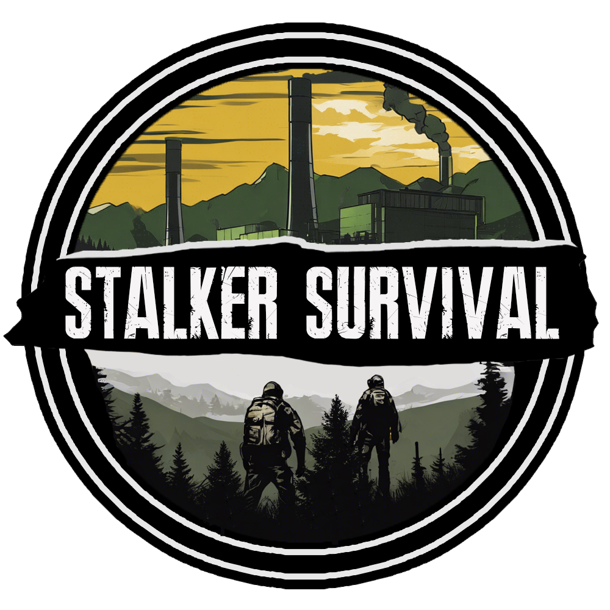
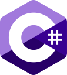

  

Lead Developer at Stalker Survival | Unity Developer | .NET & C#

<table>
  <tr >
    <td align="center" width="60px"></td>
    <td>Unity Engine is essential for my game development workflow. It facilitated my transition to a full-time game developer role, with a focus on C# for scripting and gameplay programming.</td>
  </tr>
  <tr>
    <td align="center" width="60px"></td>
    <td>DayZ modding introduced me to game customization, enhancing gameplay and adding new features. My involvement started over a year ago, focusing on extending the game's capabilities.</td>
  </tr>
  <tr>
    <td align="center" width="60px"></td>
    <td>Docker is crucial for my deployment workflow, allowing for efficient, containerized application deployment. My background in DevOps provided me with the skills to leverage Docker effectively.</td>
  </tr>
  <tr>
    <td align="center" width="60px"></td>
    <td>Linux OS is a key part of my development and deployment environment, hosting Docker nodes and various services. I rely on Linux for its stability and versatility in different use cases.</td>
  </tr>
  <tr>
    <td align="center" width="60px"></td>
    <td>I develop custom scripts for data processing, automation, and tool creation, enhancing workflow efficiency. Scripting is integral to solving unique challenges and automating repetitive tasks.</td>
  </tr>
  <tr>
    <td align="center" width="60px"></td>
    <td>C# is my primary programming language for developing robust and scalable applications. I appreciate its clear syntax and the powerful features provided by the .NET framework.</td>
  </tr>
</table>
