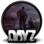

## 

Lead Developer of Stalker Survival, Full time Unity Developer, .NET & C#

<table>
  <tr>
    <th></th>
    <th></th>
  </tr>
  <tr>
    <td></td>
    <td>Unity Engine is something I cannot live without at the moment. The Unity has got me into game dev and can work as a full time game developer with a great passion to C# and programming.</td>
  </tr>
  <tr>
    <td> </td>
    <td>DayZ is one of my favorite games and I got into modding quite recently (approx 1yr+ ago). I really like the way of extending this amazing game and adding new stuff.</td>
  </tr>
  <tr>
    <td></td>
    <td>Docker is a boat I can sail across the servers and deploy apps really efficiently. As a former "dev ops" worker I had the chance to learn this concept of conteinarized apps and use this as my daily tool.</td>
    </tr>
    <tr>
    <td></td>
    <td>Linux is my good friend and we host together couple docker nodes and serve some cool services to the internet. I use Linux based OS for multiple purposes, especially for Python environments, docker hosts, proxy server, easier deployment for my apps.</td>
    </tr>
    <tr>
    <td></td>
    <td>Development of custom scripts for data processing, parsers, web scrappers, useful tools for specific scenarios. Mainly I use scripts to imporve the efficiency of my workflow.</td>
    </tr>
    <tr>
    <td></td>
    <td>My survival knife and tool I can craft the unique code and programs. Simply like the syntax, features of the language.</td>
    </tr>
    <tr>
    </tr>
</table>
<!--

Here are some ideas to get you started:

- 🔭 I’m currently working on ...
- 🌱 I’m currently learning ...
- 👯 I’m looking to collaborate on ...
- 🤔 I’m looking for help with ...
- 💬 Ask me about ...
- 📫 How to reach me: ...
- 😄 Pronouns: ...

-->
